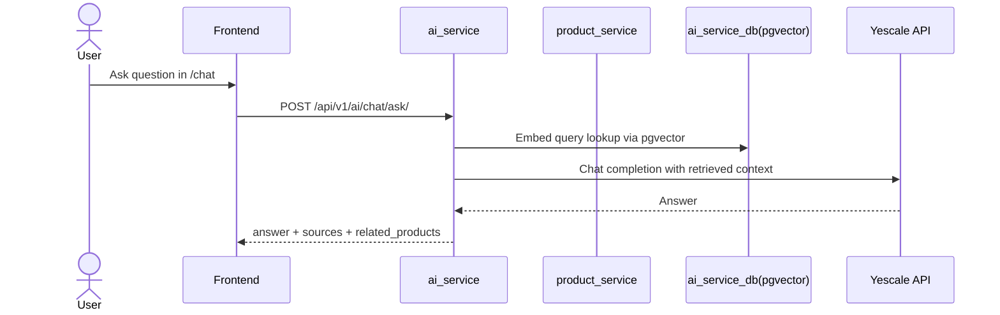

# AI RAG + pgvector Proposal

## 1. Overview

- [Target] Build an implementation-ready upgrade for `ai_service` so the project satisfies the assignment requirements for `Deep Model`, `Knowledge Base`, `RAG + Chat`, and app integration without rebuilding the existing architecture.
- [Target] The user value is: a shopper can ask product or policy questions from the existing chat UI and receive an answer generated by `gpt-5.4-nano` over retrieved context indexed from real database-backed content instead of mock templates.
- [Target] Scope includes:
- replacing mock LLM chat generation with a real OpenAI-compatible provider
- replacing keyword retrieval with semantic retrieval using `pgvector`
- indexing product and policy knowledge from database-backed records
- keeping the existing frontend `/chat` integration path
- increasing seeded catalog data to at least 10 products
- [Target] Out of scope:
- replacing the current recommendation scoring engine with an LLM-based recommender
- direct cross-database reads from `ai_service` into `product_service_db`
- real-time product reindex on every catalog mutation
- Neo4j graph completion work
- [Open question] The user provided `https://api.yescale.io/v1/chat/completions` for chat, but did not provide the embedding endpoint. The proposal assumes an OpenAI-compatible embeddings endpoint at `https://api.yescale.io/v1/chat/completions`.
- [Risk] The API key was shared in chat. It should be rotated before implementation starts. The implementation must not copy the raw key into tracked documentation or `.env.example`.
- [Risk] Root `.env` is currently tracked in the repo state, and there is no root `.gitignore`. Adding `.gitignore` alone will not untrack an already tracked `.env`.

## 2. Current state [Current]

- [Current] `ai_service` is a standalone Django service mounted by [docker-compose.yml](/home/WORK/lamnh/others/TechShop/docker-compose.yml) on port `8008` with its own PostgreSQL container `ai_service_db`.
- [Current] `ai_service` uses plain PostgreSQL via `django.db.backends.postgresql` in [services/ai_service/config/settings.py](/home/WORK/lamnh/others/TechShop/services/ai_service/config/settings.py) and does not install `pgvector` or `django.contrib.postgres` app extensions beyond standard Django Postgres support.
- [Current] `ai_service` settings expose only `LLM_PROVIDER` and `LLM_API_KEY` as model-provider config in [services/ai_service/config/settings.py](/home/WORK/lamnh/others/TechShop/services/ai_service/config/settings.py). There are no embedding-model settings, no base URL setting, and no vector dimension setting.
- [Current] Root `.env.example` includes `LLM_PROVIDER` and `LLM_API_KEY` only; it does not include a chat model, embedding model, provider base URL, or internal AI sync settings in [.env.example](/home/WORK/lamnh/others/TechShop/.env.example).
- [Current] `services/ai_service/.env.example` mirrors that limitation and does not include provider base URL or embedding config in [services/ai_service/.env.example](/home/WORK/lamnh/others/TechShop/services/ai_service/.env.example).
- [Current] There is no root `.gitignore` in the repository.
- [Current] `KnowledgeDocumentModel` and `KnowledgeChunkModel` already exist in [services/ai_service/modules/ai/infrastructure/models.py](/home/WORK/lamnh/others/TechShop/services/ai_service/modules/ai/infrastructure/models.py). `KnowledgeChunkModel` stores only `content`, `embedding_ref`, and `metadata`; it does not store embeddings or vector indexes in PostgreSQL.
- [Current] `IngestKnowledgeDocumentUseCase.execute()` creates `KnowledgeDocument` rows and paragraph-based `KnowledgeChunk` rows in [services/ai_service/modules/ai/application/services.py](/home/WORK/lamnh/others/TechShop/services/ai_service/modules/ai/application/services.py). It does not generate embeddings.
- [Current] Retrieval is keyword-based only. `SimpleRetrievalService.retrieve_relevant_chunks()` delegates to `DjangoKnowledgeChunkRepository.search_similar()`, which uses `content__icontains=query` in [services/ai_service/modules/ai/infrastructure/domain_services.py](/home/WORK/lamnh/others/TechShop/services/ai_service/modules/ai/infrastructure/domain_services.py) and [services/ai_service/modules/ai/infrastructure/repositories.py](/home/WORK/lamnh/others/TechShop/services/ai_service/modules/ai/infrastructure/repositories.py).
- [Current] Chat generation is mock-only. `GenerateChatAnswerUseCase.execute()` retrieves chunks, concatenates text, then calls `get_llm_provider()` in [services/ai_service/modules/ai/application/services.py](/home/WORK/lamnh/others/TechShop/services/ai_service/modules/ai/application/services.py). `get_llm_provider()` always returns `MockLLMProvider` even when `LLM_PROVIDER=openai` or `anthropic` in [services/ai_service/modules/ai/infrastructure/providers.py](/home/WORK/lamnh/others/TechShop/services/ai_service/modules/ai/infrastructure/providers.py).
- [Current] `ChatAskAPIView` accepts `session_id`, `query`, `user_id`, and `context` in [services/ai_service/modules/ai/presentation/serializers.py](/home/WORK/lamnh/others/TechShop/services/ai_service/modules/ai/presentation/serializers.py), but `GenerateChatAnswerUseCase.execute()` does not persist chat turns and the current API response always reports `"mode": "mock_llm"`.
- [Current] The frontend `/chat` page already integrates with the current AI API by calling `/ai/api/v1/ai/chat/sessions/` and `/ai/api/v1/ai/chat/ask/` in [frontend/src/app/chat/page.tsx](/home/WORK/lamnh/others/TechShop/frontend/src/app/chat/page.tsx) and [frontend/src/services/api/ai.ts](/home/WORK/lamnh/others/TechShop/frontend/src/services/api/ai.ts).
- [Current] `product_service` already exposes read APIs for public catalog browsing and filtering in [services/product_service/modules/catalog/presentation/views.py](/home/WORK/lamnh/others/TechShop/services/product_service/modules/catalog/presentation/views.py). It also exposes internal product snapshot/bulk endpoints through `InternalProductViewSet`.
- [Current] `InternalServicePermission` in `product_service` is placeholder-only and checks for `X-Internal-Service` and `X-Internal-Token`, not `X-Internal-Service-Key`, in [services/product_service/modules/catalog/presentation/permissions.py](/home/WORK/lamnh/others/TechShop/services/product_service/modules/catalog/presentation/permissions.py). This is inconsistent with the rest of the system, where internal clients use `X-Internal-Service-Key`.
- [Current] The master seed script defines only 8 demo products in [shared/scripts/seed_complete_system.py](/home/WORK/lamnh/others/TechShop/shared/scripts/seed_complete_system.py), so the current seeded catalog does not reliably satisfy the assignment requirement of `>= 10` products.
- [Current] The master seed script inserts AI knowledge through `/api/v1/admin/ai/knowledge/` and behavioral events through `/api/v1/internal/ai/events/`, but it does not perform product-to-knowledge indexing in [shared/scripts/seed_complete_system.py](/home/WORK/lamnh/others/TechShop/shared/scripts/seed_complete_system.py).
- [Current] The e2e test flow for AI is stale: it performs `GET /api/v1/ai/recommendations/` in [shared/scripts/e2e_integration_test.py](/home/WORK/lamnh/others/TechShop/shared/scripts/e2e_integration_test.py), while the current backend exposes recommendations as `POST /api/v1/ai/recommendations/`.

## 3. Target behavior [Target]

- [Target] `ai_service` remains the owner of chat, retrieval, and vector search. It does not read `product_service_db` directly. It ingests product data through service APIs, transforms it into AI-owned `KnowledgeDocument` and `KnowledgeChunk` rows, and stores embeddings in `ai_service_db` using `pgvector`.
- [Target] The provider integration uses:
- chat model: `gpt-5.4-nano`
- embedding model: `text-embedding-3-small`
- provider base URL: `https://api.yescale.io/v1`
- [Target] `KnowledgeChunkModel` stores a real vector column with the embedding for each chunk. Semantic retrieval uses pgvector similarity search over that column.
- [Target] Product knowledge is derived from current catalog records. For each published product, `ai_service` stores or updates one AI-owned knowledge document with metadata such as `product_id`, `brand_name`, `category_name`, `base_price`, `thumbnail_url`, and `slug`. The chunk content contains a compact product description assembled from existing fields.
- [Target] Policy and support knowledge continue to use the existing admin knowledge ingestion route, but ingestion now also computes and persists embeddings.
- [Target] A new management command performs product knowledge sync from `product_service` to `ai_service`. The sync is explicit and repeatable; automatic real-time reindex is not part of this milestone.
- [Target] Chat flow:



- [Target] On product queries, the chat endpoint returns:
- natural-language answer
- `sources` identifying the indexed chunks used
- `related_products` derived from retrieved product chunk metadata
- [Target] On policy queries, the chat endpoint returns answer plus policy document sources; `related_products` may be empty.
- [Target] If `session_id` is provided, the user question and assistant answer are persisted to `ChatMessageModel`. If `session_id` is omitted, the request is treated as stateless and no session is auto-created by `chat/ask`.
- [Target] If provider config is missing or the LLM/embedding upstream fails, the API returns explicit failure:
- `503` for provider misconfiguration or provider unavailable
- `504` for upstream timeout
- `400` for invalid input
- [Target] The system must not silently fall back to `MockLLMProvider` or keyword-only retrieval in production paths.
- [Target] The root `.env` holds local secret values for Docker Compose interpolation, and a new root `.gitignore` excludes `.env` and service-local `.env` files from future commits.
- [Target] The implementation uses the existing frontend chat page; UI changes are limited to rendering `sources` and optional `related_products`.

## 4. Implementation approach [Gap]

- [Gap] Replace the mock provider path in `services/ai_service/modules/ai/infrastructure/providers.py`.
- [Target] Extend the existing provider owner instead of creating a new provider module. Add a real OpenAI-compatible implementation that uses `httpx`.
- [Target] Modify the existing interface in `BaseLLMProvider` to support embeddings because the same provider is called by two concrete callers in this task:
- `IngestKnowledgeDocumentUseCase.execute()`
- `GenerateChatAnswerUseCase.execute()`

```python
class BaseLLMProvider(ABC):
    def classify_intent(self, query: str) -> str: ...
    def generate_answer(
        self,
        query: str,
        context: str,
        chat_history: Optional[List[Dict[str, str]]] = None,
        user_context: Optional[Dict[str, Any]] = None,
    ) -> str: ...
    def generate_embeddings(self, texts: List[str]) -> List[List[float]]: ...
```

- [Gap] Add provider config to `services/ai_service/config/settings.py` and root/env templates.
- [Target] Add exact keys:
- `AI_PROVIDER=yescale`
- `AI_API_BASE_URL=https://api.yescale.io/v1`
- `AI_CHAT_COMPLETIONS_URL=https://api.yescale.io/v1/chat/completions`
- `AI_EMBEDDINGS_URL=[Assumption] https://api.yescale.io/v1/embeddings`
- `AI_API_KEY=<local secret only>`
- `AI_CHAT_MODEL=gpt-5.4-nano`
- `AI_EMBEDDING_MODEL=text-embedding-3-small`
- `AI_EMBEDDING_DIMENSIONS=1536`
- `PRODUCT_SERVICE_URL=http://product_service:8002`
- `INTERNAL_SERVICE_KEY=<shared service key>`
- [Gap] Root `.env` alone is not enough for the running containers today. `docker-compose.yml` must explicitly forward the new AI provider variables into `ai_service`, and `services/ai_service/.env.example` must document them for local non-Docker runs.
- [Gap] Add pgvector storage to the existing AI chunk model rather than creating a parallel vector table.
- [Target] Modify `KnowledgeChunkModel` in `services/ai_service/modules/ai/infrastructure/models.py` to add a vector column and optional retrieval metadata fields. Keep `metadata` as the owner for product references and source annotations.

```python
class KnowledgeChunkModel(models.Model):
    ...
    embedding = VectorField(dimensions=1536, null=True, blank=True)
```

- [Target] Keep `embedding_ref` only if needed for temporary compat during migration.
- [Target] `# COMPAT: preserve embedding_ref reads during migration -- DELETE after 2026-05-31 once all chunks are backfilled`
- [Gap] `DocumentType` currently has no product-document value.
- [Target] Modify `DocumentType` in `services/ai_service/modules/ai/domain/value_objects.py` to add `PRODUCT_CATALOG = "product_catalog"` so products can be indexed using the existing knowledge document pipeline.
- [Gap] Semantic indexing must happen at ingestion time.
- [Target] Modify `IngestKnowledgeDocumentUseCase.execute()` in `services/ai_service/modules/ai/application/services.py` so it:
- creates the document
- chunks the content
- calls `generate_embeddings()` on chunk texts
- persists vectors with each chunk
- [Gap] Product data is not currently represented in AI-owned knowledge tables.
- [Target] Add one management command under the existing command owner `services/ai_service/modules/ai/management/commands/` to sync published products into AI knowledge rows.
- [Target] Add a product-service client function in the existing owner `services/ai_service/modules/ai/infrastructure/providers.py` or `repositories.py` only if the code can be absorbed there. Preferred location is `repositories.py` because it already owns data fetch/persist logic.
- [Target] Proposed function signature:

```python
def sync_product_catalog_knowledge(
    *,
    page_size: int = 100,
    include_unpublished: bool = False,
) -> dict[str, int]:
    ...
```

- [Target] This sync reads products from `product_service` API, not from `product_service_db`, to preserve service boundaries.
- [Gap] `product_service` internal auth is inconsistent with the rest of the repo.
- [Target] Modify `InternalServicePermission` in `services/product_service/modules/catalog/presentation/permissions.py` to validate `X-Internal-Service-Key` against `INTERNAL_SERVICE_KEY`, matching the rest of the microservices.
- [Target] Also add `INTERNAL_SERVICE_KEY` wiring to `product_service` in `docker-compose.yml` and relevant env examples.
- [Gap] Chat persistence is incomplete.
- [Target] Modify `GenerateChatAnswerUseCase.execute()` to:
- load recent chat history when `session_id` is present
- persist the user message and assistant reply through `AppendChatMessageUseCase`
- choose retrieval filters from classified intent
- include `related_products` when chunk metadata contains `product_id`
- [Target] Proposed signature change:

```python
def execute(
    self,
    query: str,
    user_id: Optional[UUID] = None,
    session_id: Optional[UUID] = None,
    user_context: Optional[Dict[str, Any]] = None,
    chat_history: Optional[List[Dict[str, str]]] = None,
) -> Dict[str, Any]:
    ...
```

- [Gap] `ChatAskAPIView` currently ignores `session_id` in the use-case call.
- [Target] Modify `ChatAskAPIView.post()` to pass `session_id` into the use case and map provider failures to `503`/`504`.
- [Gap] The current frontend consumes only `answer`.
- [Target] Modify the existing frontend API/client and page to render `sources` and `related_products` without changing the route structure.
- [Gap] The current seed data has only 8 products.
- [Target] Modify `DEMO_PRODUCTS` in `shared/scripts/seed_complete_system.py` to at least 10 products and call the new AI product-sync command after catalog seed.
- [Gap] The current e2e AI flow tests the wrong recommendation method and does not test RAG chat.
- [Target] Modify the existing `shared/scripts/e2e_integration_test.py` to:
- use `POST /api/v1/ai/recommendations/`
- add a real `POST /api/v1/ai/chat/ask/` assertion over seeded policy or product knowledge

## 5. File impact

```text
TechShop/
├── .gitignore                                            ← Add: ignore root/service .env files
├── .env.example                                          ← Modify: document AI provider config
├── docker-compose.yml                                    ← Modify: ai_service pgvector + env wiring
├── frontend/
│   ├── src/app/chat/page.tsx                             ← Modify: render sources/related products
│   └── src/services/api/ai.ts                            ← Modify: typed chat response fields
├── services/
│   ├── ai_service/
│   │   ├── .env.example                                  ← Modify: document provider + pgvector config
│   │   ├── requirements.txt                              ← Modify: add pgvector client dependency
│   │   ├── config/settings.py                            ← Modify: add AI provider/env settings
│   │   ├── modules/ai/domain/value_objects.py            ← Modify: add product_catalog document type
│   │   ├── modules/ai/infrastructure/models.py           ← Modify: add vector field to chunks
│   │   ├── modules/ai/infrastructure/providers.py        ← Modify: real Yescale chat/embedding client
│   │   ├── modules/ai/infrastructure/repositories.py     ← Modify: pgvector similarity query + product sync
│   │   ├── modules/ai/infrastructure/domain_services.py  ← Modify: semantic retrieval service
│   │   ├── modules/ai/application/services.py            ← Modify: embed on ingest + real chat flow
│   │   ├── modules/ai/presentation/serializers.py        ← Modify: response contract for sources/products
│   │   ├── modules/ai/presentation/views.py              ← Modify: pass session_id, map upstream failures
│   │   ├── modules/ai/management/commands/
│   │   │   └── sync_product_knowledge.py                 ← Add: explicit product knowledge sync command
│   │   ├── modules/ai/migrations/0002_*_pgvector.py      ← Add [Assumption]: vector schema migration
│   │   └── tests/
│   │       └── test_rag_chat.py                          ← Add: AI integration tests
│   └── product_service/
│       ├── .env.example                                  ← Modify: add INTERNAL_SERVICE_KEY if missing
│       └── modules/catalog/presentation/permissions.py   ← Modify: validate X-Internal-Service-Key
├── shared/
│   ├── scripts/seed_complete_system.py                   ← Modify: >=10 products + AI product sync
│   └── scripts/e2e_integration_test.py                   ← Modify: real RAG chat and corrected rec flow
└── shared/docs/AI_RAG_PGVECTOR_PROPOSAL.md               ← Add: this plan
```

| Path | Action | What changes | Why |
|------|--------|--------------|-----|
| `.gitignore` | Add | Ignore `.env`, `services/*/.env`, common Python cache files | Prevent future secret commits |
| `.env.example` | Modify | Add `AI_*` provider/model settings and `INTERNAL_SERVICE_KEY` docs | Root compose interpolation needs documented keys |
| `docker-compose.yml` | Modify | Switch `ai_service_db` to pgvector-capable image and pass AI config into `ai_service` | pgvector is a DB dependency, not an app-only dependency |
| `services/ai_service/requirements.txt` | Modify | Add `pgvector` Python package | Django model/repository needs VectorField support |
| `services/ai_service/config/settings.py` | Modify | Add provider URL/model/dimension/internal config | Remove hardcoded placeholders |
| `services/ai_service/modules/ai/domain/value_objects.py` | Modify | Add `DocumentType.PRODUCT_CATALOG` | Reuse existing document pipeline for products |
| `services/ai_service/modules/ai/infrastructure/models.py` | Modify | Add vector field to `KnowledgeChunkModel` | Store embeddings in Postgres |
| `services/ai_service/modules/ai/infrastructure/providers.py` | Modify | Implement real chat + embedding API calls | Replace mock-only provider path |
| `services/ai_service/modules/ai/infrastructure/repositories.py` | Modify | Add pgvector similarity search and product sync fetch logic | Repository already owns persistence and retrieval queries |
| `services/ai_service/modules/ai/infrastructure/domain_services.py` | Modify | Replace keyword retrieval with semantic retrieval | Keep retrieval owned by existing domain service file |
| `services/ai_service/modules/ai/application/services.py` | Modify | Embed on ingest, persist chat turns, enrich responses | Application layer owns use-case orchestration |
| `services/ai_service/modules/ai/presentation/views.py` | Modify | Pass `session_id`, handle provider errors, preserve API route | Current view is the HTTP boundary owner |
| `services/ai_service/modules/ai/management/commands/sync_product_knowledge.py` | Add | Sync product catalog into AI knowledge tables | No existing command owns this behavior |
| `services/product_service/modules/catalog/presentation/permissions.py` | Modify | Align internal auth header contract | Required so AI service can fetch internal catalog safely |
| `shared/scripts/seed_complete_system.py` | Modify | Seed >=10 products and trigger product sync | Assignment/demo data must reflect target feature |
| `shared/scripts/e2e_integration_test.py` | Modify | Add real chat verification and fix rec method | Current AI e2e contract is stale |
| `frontend/src/app/chat/page.tsx` | Modify | Render sources and related products | Existing route remains the integration point |

- [Target] Config keys added:
- `AI_PROVIDER=yescale`
- `AI_API_BASE_URL=https://api.yescale.io/v1`
- `AI_CHAT_COMPLETIONS_URL=https://api.yescale.io/v1/chat/completions`
- `AI_EMBEDDINGS_URL=[Assumption] https://api.yescale.io/v1/embeddings`
- `AI_API_KEY` with no default in production
- `AI_CHAT_MODEL=gpt-5.4-nano`
- `AI_EMBEDDING_MODEL=text-embedding-3-small`
- `AI_EMBEDDING_DIMENSIONS=1536`
- `INTERNAL_SERVICE_KEY`
- [Target] API contract changes:
- `POST /api/v1/ai/chat/ask/` continues to exist but now uses `session_id` if provided
- response `sources` must include enough metadata to render source labels
- response `related_products` becomes a supported field for product-grounded answers
- [Target] DB schema changes:
- migration required for pgvector extension enablement and `KnowledgeChunkModel.embedding`
- [Dependency] Database image change or extension availability must be approved because it changes the runtime container image for `ai_service_db`
- [Target] Permission/auth changes:
- `product_service` internal endpoints move from placeholder internal headers to `X-Internal-Service-Key`
- [Target] Observability changes:
- add entry/exit logs for embedding requests, retrieval hit count, and upstream provider latency
- add warning logs for missing embeddings and sync drift counts

## 6. Commit plan

```text
chore(ai): wire provider and pgvector config

Objective: add runtime configuration for Yescale chat/embedding and pgvector-backed ai_service DB
Files: .gitignore, .env.example, docker-compose.yml, services/ai_service/.env.example, services/ai_service/config/settings.py, services/ai_service/requirements.txt, services/product_service/.env.example
Config: add AI_* keys and INTERNAL_SERVICE_KEY docs
Depends on: none
Verify: docker compose config
```

```text
feat(ai): add pgvector storage to knowledge chunks

Objective: persist semantic embeddings in ai_service_db using the existing knowledge chunk model
Files: services/ai_service/modules/ai/domain/value_objects.py, services/ai_service/modules/ai/infrastructure/models.py, services/ai_service/modules/ai/migrations/0002_*_pgvector.py, services/ai_service/modules/ai/infrastructure/repositories.py
Config: AI_EMBEDDING_DIMENSIONS
Depends on: previous commit
Verify: python manage.py makemigrations --check && python manage.py migrate
```

```text
feat(ai): replace mock provider and retrieval with real semantic RAG

Objective: use Yescale chat + embeddings and pgvector similarity search in the existing chat flow
Files: services/ai_service/modules/ai/infrastructure/providers.py, services/ai_service/modules/ai/infrastructure/domain_services.py, services/ai_service/modules/ai/application/services.py, services/ai_service/modules/ai/presentation/serializers.py, services/ai_service/modules/ai/presentation/views.py
Config: AI_PROVIDER, AI_API_BASE_URL, AI_CHAT_COMPLETIONS_URL, AI_EMBEDDINGS_URL, AI_CHAT_MODEL, AI_EMBEDDING_MODEL
Depends on: previous commit
Verify: python manage.py test services/ai_service/tests -v 2
```

```text
feat(ai): sync product catalog into AI knowledge store

Objective: index real catalog data into AI-owned knowledge documents without direct cross-DB reads
Files: services/ai_service/modules/ai/infrastructure/repositories.py, services/ai_service/modules/ai/management/commands/sync_product_knowledge.py, services/product_service/modules/catalog/presentation/permissions.py
Config: PRODUCT_SERVICE_URL, INTERNAL_SERVICE_KEY
Depends on: previous commit
Verify: python manage.py sync_product_knowledge --dry-run
```

```text
test(demo): upgrade seeded data and real e2e AI checks

Objective: make demo data satisfy >=10 products and verify real chat/retrieval flows
Files: shared/scripts/seed_complete_system.py, shared/scripts/e2e_integration_test.py, frontend/src/services/api/ai.ts, frontend/src/app/chat/page.tsx, services/ai_service/tests/test_rag_chat.py
Config: none
Depends on: previous commit
Verify: python shared/scripts/seed_complete_system.py --verbose && python shared/scripts/e2e_integration_test.py --verbose
```

## 7. Test specs

| Scenario | Input | Expected | Notes |
|----------|-------|----------|-------|
| Product sync happy path | `python manage.py sync_product_knowledge` | AI DB contains `product_catalog` knowledge documents and chunks for published products | Must not read product DB directly |
| Knowledge ingest happy path | `POST /api/v1/admin/ai/knowledge/` with policy content | Document + chunk rows persisted with non-null embeddings | Verifies ingest path |
| Semantic retrieval | Query semantically similar to stored policy text | `retrieve_relevant_chunks()` returns chunks even when exact keyword is absent | Must prove semantic, not `icontains` |
| Chat happy path product query | `POST /api/v1/ai/chat/ask/` with "dien thoai Samsung duoi 10 trieu" | Response `200`, non-empty `answer`, non-empty `sources`, `related_products` contains product metadata | Input should match seeded catalog |
| Chat happy path policy query | `POST /api/v1/ai/chat/ask/` with return/shipping question | Response `200` with policy-grounded answer and policy source rows | Must not return product-only context |
| Session persistence | `POST /api/v1/ai/chat/ask/` with valid `session_id` | User and assistant messages stored in `ChatMessageModel` | Current code does not do this |
| Provider misconfig | Missing `AI_API_KEY` | API returns `503`, no mock fallback | Required by no-fake-production rule |
| Upstream timeout | Simulated provider timeout | API returns `504` with structured error | Timeout must not look like success |
| Internal auth mismatch | Product sync with wrong `X-Internal-Service-Key` | Sync fails explicitly | Verifies aligned internal contract |
| Seed compliance | Full seed run | Catalog count >= 10 products | Supports assignment requirement |

**Real tests (required for AI-facing and E2E paths):**

```text
Input:    POST /api/v1/ai/chat/ask/ with query="Chinh sach doi tra nhu the nao?"
Setup:    docker compose stack running, policy docs seeded, ai_service_db migrated with pgvector, AI provider configured
Expected: HTTP 200, response.data.answer non-empty, response.data.sources length > 0, response.data.mode = "yescale_rag"
Pass rule: All assertions verified in one run against real PostgreSQL and real provider
Fail rule: Empty sources, mock mode, or success response with fallback text
```

```text
Input:    python manage.py sync_product_knowledge && POST /api/v1/ai/chat/ask/ with query="Samsung nao duoi 10 trieu?"
Setup:    product catalog seeded with >=10 products, sync command completed successfully
Expected: HTTP 200, at least one related product with Samsung metadata and price <= 10000000, sources reference product_catalog chunks
Pass rule: Related product and source both grounded in indexed DB-backed catalog data
Fail rule: No related products, no sources, or answer produced without retrieval evidence
```

- [Target] AI response failure patterns:
- answer states unsupported when relevant knowledge exists
- answer contains no sources for a successful RAG response
- answer returns mock template language after real provider is configured
- product answer suggests products not present in indexed catalog metadata

## 8. Definition of done

- [ ] All planned commits land and each commit leaves the repo in a runnable state
- [ ] `ai_service_db` runs with pgvector support and migration applies cleanly
- [ ] `MockLLMProvider` is not used in production chat or retrieval paths
- [ ] Root `.gitignore` prevents future `.env` commits
- [ ] Root `.env` and service env docs include the required AI provider keys without storing the secret in tracked files
- [ ] Product seed count is at least 10
- [ ] Product sync command indexes catalog data into AI knowledge rows
- [ ] Real chat requests return grounded `sources`
- [ ] Frontend `/chat` renders the new response fields without route changes
- [ ] `shared/scripts/e2e_integration_test.py` validates a real AI chat path
- [ ] No unresolved `[Open question]` blocks implementation start
