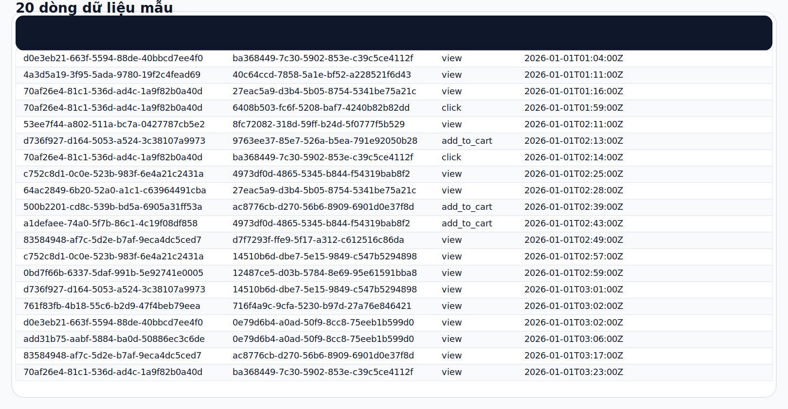
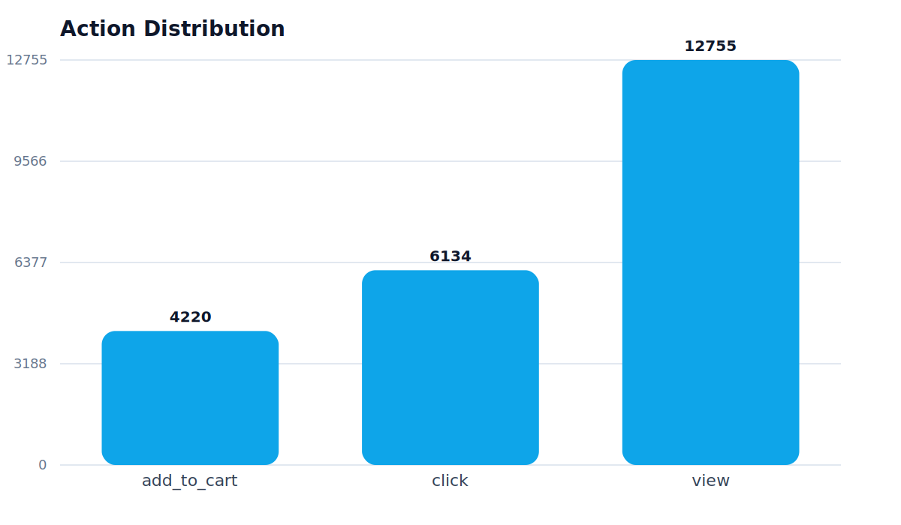
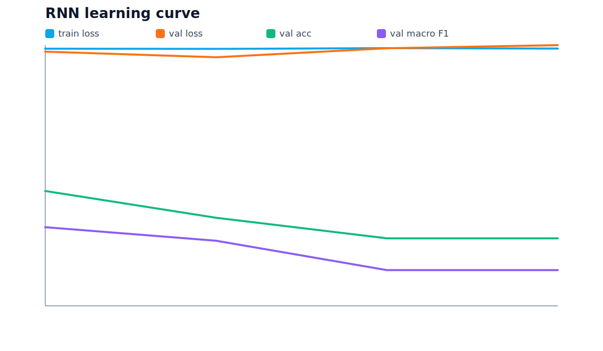
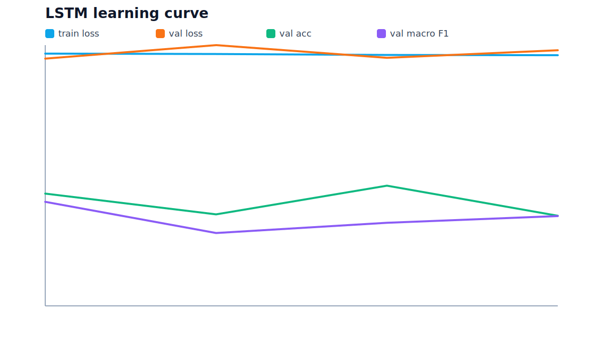
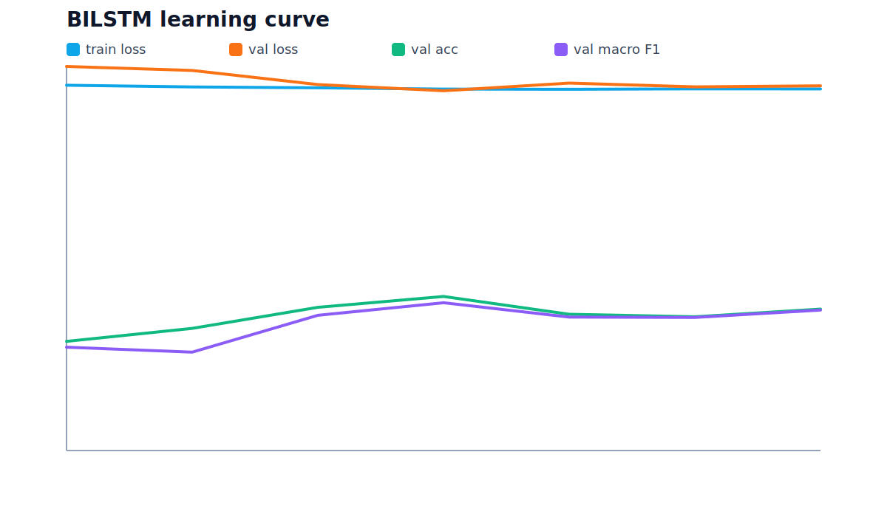
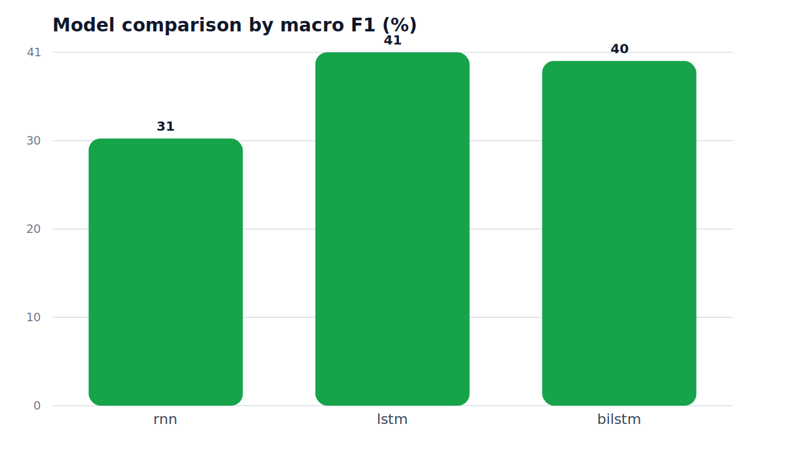
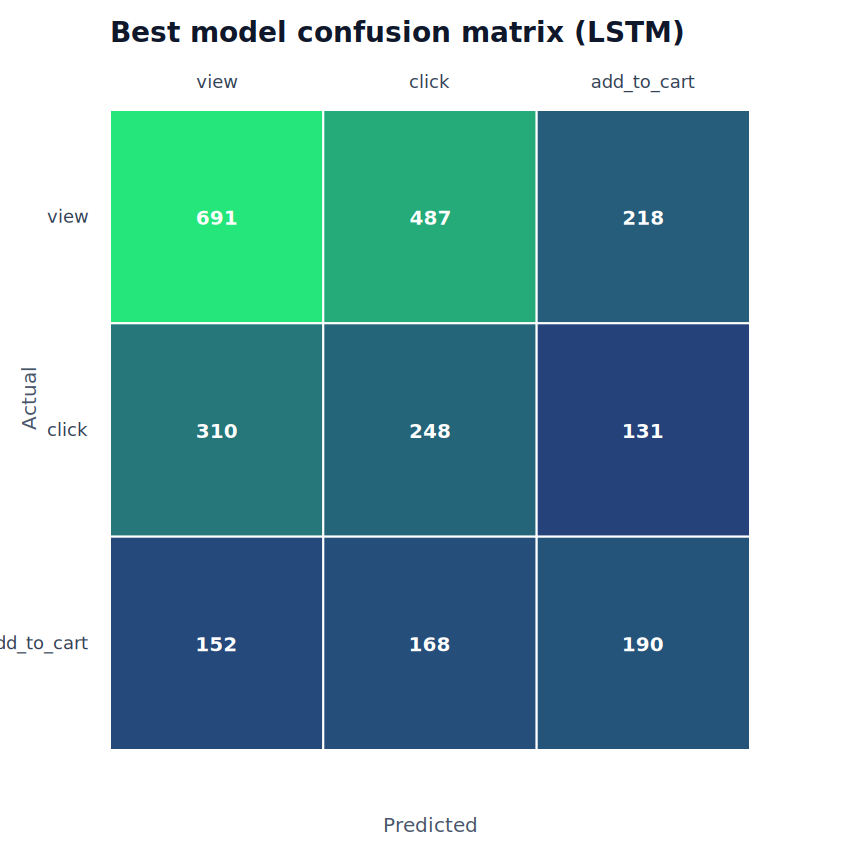
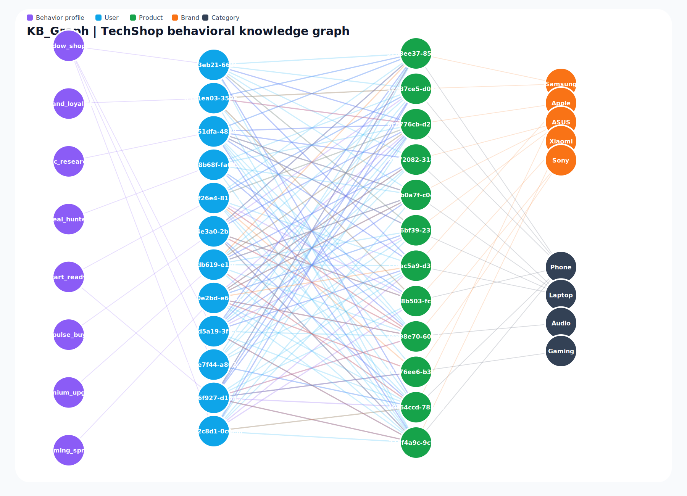
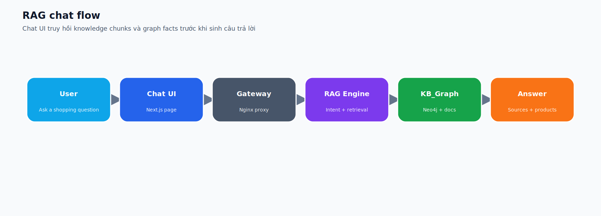
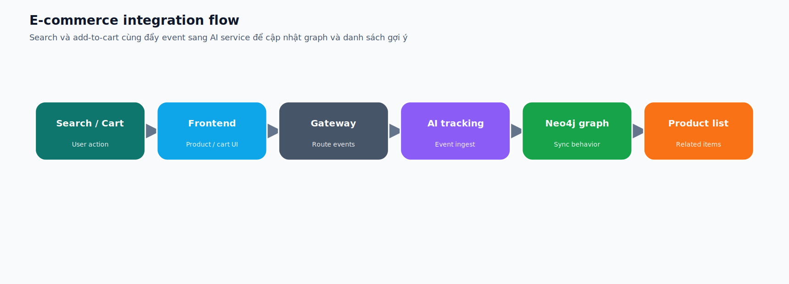

# AISERVICE 02 - TechShop

## 1. Trang bìa

| Mục | Nội dung |
| --- | --- |
| Môn học | AI Service |
| Đề tài | AI Service cho TechShop |
| Sinh viên | __________________ |
| Lớp / Nhóm | __________________ |
| Ngày nộp | 20/04/2026 |

## 2. Mô tả AISERVICE

AISERVICE là dịch vụ AI của TechShop, phụ trách tracking hành vi người dùng, xây hồ sơ sở thích, gợi ý sản phẩm, truy hồi tri thức cho chat, và đồng bộ dữ liệu hành vi vào Neo4j để phục vụ KB_Graph. Trong bài nộp này, dịch vụ được dùng theo đúng 4 khối yêu cầu của thầy: sinh dữ liệu, train 3 mô hình tuần tự, dựng knowledge graph, và dựng chat/RAG tích hợp e-commerce.

## 3. Copy 20 dòng data



| user_id | product_id | action | timestamp |
| --- | --- | --- | --- |
| d0e3eb21-663f-5594-88de-40bbcd7ee4f0 | ba368449-7c30-5902-853e-c39c5ce4112f | view | 2026-01-01T01:04:00Z |
| 4a3d5a19-3f95-5ada-9780-19f2c4fead69 | 40c64ccd-7858-5a1e-bf52-a228521f6d43 | view | 2026-01-01T01:11:00Z |
| 70af26e4-81c1-536d-ad4c-1a9f82b0a40d | 27eac5a9-d3b4-5b05-8754-5341be75a21c | view | 2026-01-01T01:16:00Z |
| 70af26e4-81c1-536d-ad4c-1a9f82b0a40d | 6408b503-fc6f-5208-baf7-4240b82b82dd | click | 2026-01-01T01:59:00Z |
| 53ee7f44-a802-511a-bc7a-0427787cb5e2 | 8fc72082-318d-59ff-b24d-5f0777f5b529 | view | 2026-01-01T02:11:00Z |
| d736f927-d164-5053-a524-3c38107a9973 | 9763ee37-85e7-526a-b5ea-791e92050b28 | add_to_cart | 2026-01-01T02:13:00Z |
| 70af26e4-81c1-536d-ad4c-1a9f82b0a40d | ba368449-7c30-5902-853e-c39c5ce4112f | click | 2026-01-01T02:14:00Z |
| c752c8d1-0c0e-523b-983f-6e4a21c2431a | 4973df0d-4865-5345-b844-f54319bab8f2 | view | 2026-01-01T02:25:00Z |
| 64ac2849-6b20-52a0-a1c1-c63964491cba | 27eac5a9-d3b4-5b05-8754-5341be75a21c | view | 2026-01-01T02:28:00Z |
| 500b2201-cd8c-539b-bd5a-6905a31ff53a | ac8776cb-d270-56b6-8909-6901d0e37f8d | add_to_cart | 2026-01-01T02:39:00Z |
| a1defaee-74a0-5f7b-86c1-4c19f08df858 | 4973df0d-4865-5345-b844-f54319bab8f2 | add_to_cart | 2026-01-01T02:43:00Z |
| 83584948-af7c-5d2e-b7af-9eca4dc5ced7 | d7f7293f-ffe9-5f17-a312-c612516c86da | view | 2026-01-01T02:49:00Z |
| c752c8d1-0c0e-523b-983f-6e4a21c2431a | 14510b6d-dbe7-5e15-9849-c547b5294898 | view | 2026-01-01T02:57:00Z |
| 0bd7f66b-6337-5daf-991b-5e92741e0005 | 12487ce5-d03b-5784-8e69-95e61591bba8 | view | 2026-01-01T02:59:00Z |
| d736f927-d164-5053-a524-3c38107a9973 | 14510b6d-dbe7-5e15-9849-c547b5294898 | view | 2026-01-01T03:01:00Z |
| 761f83fb-4b18-55c6-b2d9-47f4beb79eea | 716f4a9c-9cfa-5230-b97d-27a76e846421 | view | 2026-01-01T03:02:00Z |
| d0e3eb21-663f-5594-88de-40bbcd7ee4f0 | 0e79d6b4-a0ad-50f9-8cc8-75eeb1b599d0 | view | 2026-01-01T03:02:00Z |
| add31b75-aabf-5884-ba0d-50886ec3c6de | 0e79d6b4-a0ad-50f9-8cc8-75eeb1b599d0 | view | 2026-01-01T03:06:00Z |
| 83584948-af7c-5d2e-b7af-9eca4dc5ced7 | ac8776cb-d270-56b6-8909-6901d0e37f8d | view | 2026-01-01T03:17:00Z |
| 70af26e4-81c1-536d-ad4c-1a9f82b0a40d | ba368449-7c30-5902-853e-c39c5ce4112f | view | 2026-01-01T03:23:00Z |

## 4. Câu 2a: RNN, LSTM, biLSTM

Mục tiêu bài toán là dự đoán action kế tiếp từ chuỗi hành vi trước đó. Dataset có 500 user và 23109 events, được chia theo user để tránh leakage giữa train/validation/test. Metric chính để chọn model_best là macro F1 vì nhãn bị lệch giữa `view`, `click`, và `add_to_cart`.

### 4.1. Code chính

```python
class SequenceClassifier:
    def __init__(self, torch, model_type: str, seq_len: int, num_classes: int = 3):
        hidden_size = 48
        emb_dim = 12
        self.embedding = torch.nn.Embedding(4, emb_dim, padding_idx=0)
        if model_type == 'rnn':
            self.sequence = torch.nn.RNN(input_size=emb_dim + 1, hidden_size=hidden_size, batch_first=True)
        elif model_type == 'lstm':
            self.sequence = torch.nn.LSTM(input_size=emb_dim + 1, hidden_size=hidden_size, batch_first=True)
        elif model_type == 'bilstm':
            self.sequence = torch.nn.LSTM(input_size=emb_dim + 1, hidden_size=hidden_size, batch_first=True, bidirectional=True)
```

```python
def train_models(...):
    for model_name in ['rnn', 'lstm', 'bilstm']:
        model = SequenceClassifier(torch, model_name, seq_len=seq_len)
        optimizer = torch.optim.Adam(model.parameters(), lr=0.01, weight_decay=1e-4)
        ...
        if val_metrics['macro_f1'] > best_val_score:
            best_val_state = {key: value.detach().cpu().clone() for key, value in model.state_dict().items()}
    torch.save(best_state, output_dir / 'model_best.pt')
```

### 4.2. So sánh mô hình

| Model | Val macro F1 | Test macro F1 | Test accuracy |
| --- | --- | --- | --- |
| RNN | 0.3018 | 0.3071 | 0.4486 |
| LSTM | 0.3991 | 0.4053 | 0.4351 |
| BILSTM | 0.3849 | 0.3965 | 0.4135 |

Model được chọn là **LSTM** vì có validation macro F1 cao nhất (0.3991).

### 4.3. Ảnh huấn luyện








## 5. KB_Graph

KB_Graph được sinh từ cùng dataset với 23109 quan hệ hành vi, 500 user, 24 product, và các node Brand/Category/BehaviorProfile để graph nhìn giàu hơn. File `kb_graph_sample_queries.cypher` chứa các truy vấn mẫu để mở trong Neo4j Browser và chụp ảnh.

### 5.1. Ảnh 20 dòng + graph




### 5.2. Ghi chú Neo4j

Trạng thái import Neo4j khi sinh artefact: `skipped: Couldn't connect to localhost:7687 (resolved to ('127.0.0.1:7687',)):
Failed to establish connection to ResolvedIPv4Address(('127.0.0.1', 7687)) (reason [Errno 111] Connection refused)`.

## 6. Câu 2c và 2d: RAG + e-commerce integration

### 6.1. RAG chat

AISERVICE dùng chat endpoint riêng để nhận query, phân loại ý định, truy hồi tri thức từ KB_Graph và knowledge chunks, rồi trả về câu trả lời kèm nguồn và sản phẩm liên quan. Đây là luồng RAG thật, không phải giao diện mặc định của ChatGPT.



### 6.2. Tích hợp e-commerce

Khi user search hoặc thêm vào giỏ hàng, frontend gửi event qua gateway sang ai_service để cập nhật graph và profile. Đồng thời giao diện product/cart hiển thị danh sách sản phẩm liên quan thay vì chỉ trả về text.



### 6.3. Artefact dùng để nộp

- `data_user500.csv`
- `data_user500_preview.csv`
- `data_user500_20rows.svg`
- `rnn.pt`, `lstm.pt`, `bilstm.pt`, `model_best.pt`
- `actions_distribution.svg`, `model_comparison.svg`, `model_best_confusion_matrix.svg`
- `kb_graph_preview.svg`, `kb_graph_sample_queries.cypher`
- `rag_flow.svg`, `integration_flow.svg`

## 7. Kết luận

Bộ artefact này đã phủ đúng cấu trúc đề bài: dữ liệu, 3 mô hình, KB_Graph Neo4j, RAG chat, và tích hợp e-commerce. Từ file Markdown này có thể xuất PDF trực tiếp sau khi điền thông tin bìa.
